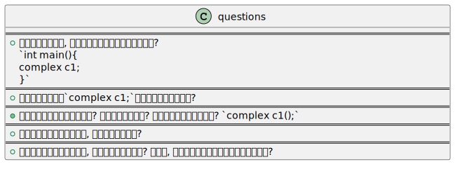

&emsp;&emsp;@author 巷北  
&emsp;&emsp;@time 2026-01-29 13:00:35  

# 简介

&emsp;&emsp;现在是在实验阶段, 哈哈. 这里会干什么东西呢? 写很多总结? 我觉得意义似乎不是很大. 要不还是以提问题的方式来学习吧, 这样能够增加思考能力, 而并非单纯地看总结, 一点意义也没有.  
&emsp;&emsp;关于提问的方式, 肯定还是要跟组块有联系, 所以不会问没学过的, 只会问学过的. 后续为了加强组块之间的联系, 会跨组块提问.  

- [构造函数](#构造函数)
    - [问题汇总](#构造函数)
        - [问题1](#问题1)
        - [问题2](#问题2)
        - [问题3](#问题3)
        - [问题4](#问题4)
        - [问题5](#问题5)

## 构造函数
### 问题汇总

#### 问题1
> 如下形式的实例化, 其内部可能得构造函数形式有哪些?
~~~cpp
int main(){
    complex c1;
}
~~~

- 没有构造函数(调用默认构造).
- 含有默认值构造函数.
- 没有参数的构造函数(complex():re(0), im(0)等).

#### 问题2
> 是否存在使得这种`complex c1;`实例化方式失败的方法?

- 存在, `complex() = delete;` 采用这种方式后, 会禁止默认构造. `c++11`之后的特性. 在单例模式实践时用过.
- 另外, 对于继承类, 如果属性含有无参构造函数(类似`A a;`), 也不能使用默认构造函数. 如下所示.
~~~cpp
class A{
    int val;
public:
    A(int val_):val(val_){}
};
class complex{
    A a;
    complex(){}
};
int main(){
    complex c1; //错
}
~~~
- 需要注意, 对于上述形式, 我们需要仔细判别. 比如下面的就是可行的.
~~~cpp
class A{
    int val;
public:
    A(int val_ = 3):val(val_){}
};
class complex{
    A a;
    complex(){}
};
int main(){
    complex c1;
}
~~~
- 而这个是错误的.
~~~cpp
class A{
    int val;
public:
    A(int val_):val(val_){}
};
class complex{
    A a(3); //声明时不能初始化
}
~~~
- 想要初始化, 只能这样.
~~~cpp
class A{
    int val;
public:
    A(int val_):val(val_){}
};
class complex{
    A a;
    complex():a(3){} //或者传入参数
}
~~~
- 当然, `c++11`后, 可以这样直接声明时初始化`A a{3}, A a = A(3)`, 这里不再展示了.
- 这些问题呢, 其实都遇到过. 但是由于`lsp` 会报错, 所以我也不会主动去分析, 只期望`lsp` 不红即可. 这样虽然能正常编译, 但是产生问题的原因却十分不明确, 肯定会为后续的学习埋下伏笔, 还是要搞明白比较好.
- 这里提前说了很多东西, 并没有放到组块里, 但是后续肯定会添加的. 这里对我来说, 相当于是组块的链接.

#### 问题3
> 下列实例化对象方式是否正确? 存在的问题是什么? 那么正确调用方式是什么? `complex c1();`

- 不对. 问题是会将`c1()`当做一次函数的声明, 返回类型是`complex`.
- 正确调用方式应该是这样`complex c1;`
- 如果我重载了`()`, 也不能扭转错误, 因为本质还是函数声明. 正确调用如下, `complex c1; c1()`.

#### 问题4
> 参数数量不对等的函数重载, 是否一定可以执行?

- 不是, 如下就会报错.
~~~cpp
class complex{
public:
    complex(double r = 0, double i = 0):re(r), im(i){}
    complex():re(0), im(0){}
private:
    double re, im;
};
int main(){
    complex c1;
}
~~~
- 实例化`c1`的时候存在二义性, 调用哪个都行.

#### 问题5
> 使用含有默认值构造函数时, 是不是尽量避免重载? 或者说, 重载时是不是尽量避免使用默认值参数?

- 是这样的, 如问题`4`所示.
