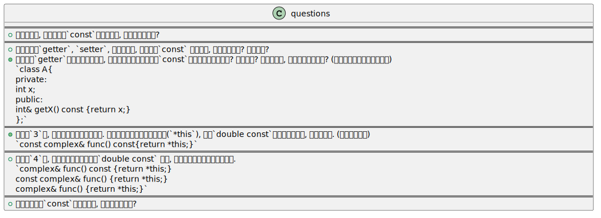

&emsp;&emsp;@author 巷北  
&emsp;&emsp;@time 2026-01-29 16:43:14  

- [const成员函数](#const成员函数)
    - [问题汇总](#问题汇总)
        - [问题1](#问题1)
        - [问题2](#问题2)
        - [问题3](#问题3)
        - [问题4](#问题4)
        - [问题5](#问题5)

# const成员函数
## 问题汇总

### 问题1
> 作为使用者, 当我们看到`const`成员函数后, 应该想到什么呢?
- 该函数内部不会主动修改成员变量.
- 这是作者提供的接口, 我只能观看.
- 我用`const`常量对象调用该成员函数(方法)是安全的.
- `cosnt` 成员函数是作者对调用者的只读承诺, 属于接口契约(`contract`), 不是实现细节.

### 问题2
> 对于一般的`getter`, `setter`, 通常情况下, 谁会使用`const` 成员函数, 谁不会使用呢? 为什么呢?
- 对于`getter`而言, 我们调用它的目的通常是"看一眼", 所以一般情况下它是`const`成员函数.
- 对于`setter`而言, 因为要给类属性赋值, 是需要修改成员变量的, 所以一般情况下它不是`const`成员函数.
- 另外, `getter`的`const`, 本质是为了**支持`const`对象的可用性**, 否则就会出现"权限不够的情况".

### 问题3
> 如果某个`getter`返回了属性的引用, 这样再强调该成员函数为`const`成员函数是否合理呢? 为什么呢? 如果不合理, 怎么改变才合理呢? (看不懂下面提供了参考代码)
~~~cpp
class A{
private:
    int x;
public:
    int& getX() const {return x;}
};
~~~
- 这样肯定不合理, 想说明白也绝非易事, 所以仔细看.
    - 对于`const`成员函数而言, `this`指针实际上是`const this`, 即上面的`const A*`. 这一点是毋庸置疑的.
    - 对于`int& getX()const` , 等价于`int& getX(const A* this)`, 也就是说, 在`const`成员函数中, `this`指针本身就是`const`类型的.
    - 通过这个`this`访问成员变量`x`, `x`的类型就是`const int`, 而不单纯地是`int`类型了.
    - 注意, 下面的操作是不被允许的. `const int cx = 3; int& r = cx;`, 为什么呢?
        - 因为你在试图用一个"可修改的引用", 绑定到一个"被承诺不可修改的对象"上. 如果`r = 10`, 此时就通过`r` 修改`cx`, 必然错误, 因为我们约定了`cx`为常量, 却还想修改它.
    - 所以, 再回看上面, 我们返回的`x`, 本质是`const int` 类型, 约定了`x`不可变, 但是返回类型确实`int&`, 默认其可修改, 这本身就是设计问题, 根本不会出现`int& A() const{}` 的结构.
- 那么如果想变得合理, 可以不返回引用, 也就是`int getX() const {return x;}`, 也可以这样`const int& getX() const{return x;}`, 效果类似, 但前者并不会运行时报错, 后者会报错. 如果是大对象, 后者常用.
- 再强调一下, 这是原始的设计问题, 不论外面`A`调用还是`const A`调用, 都错.
### 问题4
> 在问题`3`中, 我们针对的是返回类属性. 如果我们返回的是当前类对象(`*this`), 那么`double const`或许会更有意义, 请分析一下. (参考代码如下)
~~~cpp
const complex& func() const{return *this;}
~~~
- 返回当前对象, 一般情况下是为了链式调用. 链式调用是否修改对象呢? 这一点需要明确. 
- 对于后面的`const`, 强调的是调用期间, 不修改对象. 而前面的`const`, 强调的是后续链式调用只能**调用`const`成员函数**.
    - 仔细思考一下, 确实没问题. 因为如果我们通过`complex c(2, 3); c.func();`调用后, 整体实际上就是`const`了, 普通成员函数(非`const`), 并没有保证其是否改变对象属性, 所以必然无法直接调用的. 而`const` 成员函数有保证, 所以可以接着链式调用.
- 这么来看, 逻辑都闭环了, 希望能有深刻的理解吧, 哈哈.
### 问题5
> 在问题`4`中, 我们只是单纯地分析了`double const` 情况, 那么请对如下各种情况分析下.
~~~cpp
complex& func() const {return *this;}
const complex& func() {return *this;}
complex& func() {return *this;}
~~~
- 第一种, 之前说过了, 一方面约定函数内不会修改对象属性, 另一方外又提供修改权限给外面, 具有, 左右脑互博了属于.
- 第二种, 如果它是链式调用的第一个方法, 那么它会约束后续所有的链式调用都需要是`const`成员函数(它自己不是).如果它处于中间, 前面的调用都不是`const`成员函数, 但是它后面必须都是`const`成员函数. 这样来看, 不如`double const`好, 容易混乱.
- 第三种, 最基本的了, 外面想怎么调用就怎么调用, 也就是说, 第二种前面的都得是第三种这样的, 而且只能是这样的.
### 问题6
> 当我们看到非`const`成员函数时, 应该考虑什么呢?
- 它可能会修改对象.
- 它不能被`const`对象调用.
- 调用者不应该假设调用前后对象不变.
- 针对第二条, 我们的设想是什么? 真的专门命名`const complex c`对象吗? 并不是的, 应用场景如下.
~~~cpp
void func(const complex& c){
    c.real();
}
~~~
- 假如`real()`是非`const`成员函数, 这个调用必然是错误的!! 
- 这个问题似乎才是我的困惑所在, 因为在数据库+`qt`实践时, 确实是遇到过的, 哈哈.
- 所以说, 如果某个函数, 其某个参数类型是`const &`的话, 那么意味着我们只能调用该对象的`const`成员函数.
- 如果我们总是期望约定, 那么所有的必须都需要约定, 否则的话会存在意料之外的问题.

